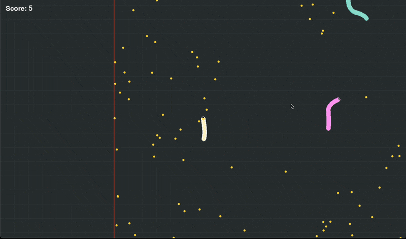

# slithbot 

A custom, lightweight implementation of a Slither-like environment designed specifically for training autonomous agents using Reinforcement Learning.

## Overview

This repository provides a sandbox environment where a snake agent must navigate a field, consume food to grow, and avoid colliding with other snakes. It is built to be highly configurable, supporting both rendered play for visualization and "headless" modes for accelerated RL training.

## Project structure
- `src/`: The engine of the game. Contains the core logic (`game.py`) and helper functions (`utils.py`).
- `config/`: YAML files to easily tweak game parameters like world size, snake count, and rendering options.
- `scripts/`: Entry points to execute the environment.
- `requirements.txt`: Python dependencies needed to get up and running.

## Getting started

### Installation

Clone the repository and install the necessary packages:

`pip install -r requirements.txt`

### Running the game

To see the environment in action using the default configuration, run:

`python scripts/run_game.py`

### Configuration

You can swap out configurations to change how the environment behaves. For example, to run without rendering (ideal for training):

`python scripts/run_game.py config/no_render.yaml`

## Gameplay demo

<!-- ## Training the Bot

The environment is designed to be wrapped in an RL framework (like Gymnasium or Stable Baselines3).

- State Space: Spatial data of nearby food and enemy segments.
- Action Space: Directional steering and boosting.
- Reward Function: Based on mass gained and survival time. -->

## License

This project is licensed under the MIT License - see the [LICENSE](LICENSE) file for details.
